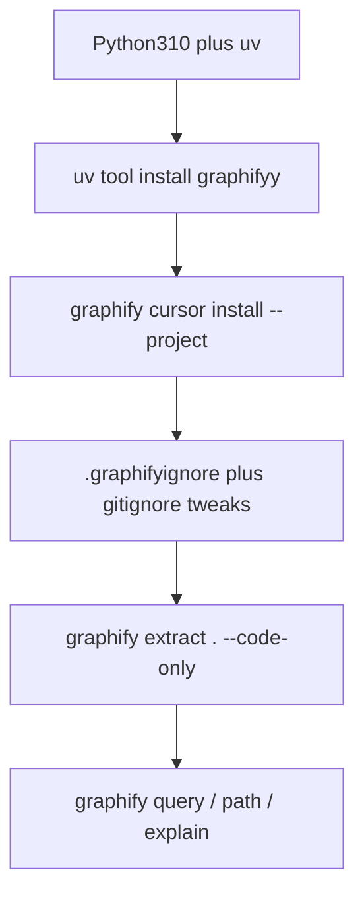

# Install and run Graphify on OCMS

OCMS is a MERN app ([package.json](package.json): Express backend + Vite/React frontend). Graphify will map JS/JSX routes, models, controllers, and imports with **local tree-sitter** — no API key for a first **code-only** graph. You chose **project-scoped** files so they can be committed.

The CLI itself still lives on your user machine (`uv`/`pipx`). `--project` only writes skill/rule files **into this repo**.



## 1. Prerequisites (once on this PC)

- Python **3.10+**
- **uv** (recommended): `winget install astral-sh.uv`
- After install, if `graphify` is not found: `uv tool update-shell`, then open a new PowerShell (uv puts the binary in `~/.local/bin`)

Do not add Graphify as an npm dependency. It is a Python tool.

## 2. Install the CLI

```powershell
uv tool install graphifyy
graphify --version
```

PyPI name is `graphifyy`; the command is `graphify`. On PowerShell use `graphify .` — a leading `/` is a path separator, not a slash command.

## 3. Project-scoped assistant wiring (this repo)

From the OCMS root (`c:\Users\Nyandoro\Desktop\portfolio\AutoScale\OCMS`):

```powershell
graphify cursor install --project
```

That writes [`.cursor/rules/graphify.mdc`](.cursor/rules/graphify.mdc) (`alwaysApply: true`) so Cursor prefers `graphify query` over raw greps in this project.

Optionally also register the generic skill in-repo (useful if anyone uses Codex/Claude on the same clone):

```powershell
graphify install --project --platform agents
```

Expected new paths (commit these if you want the team to get the skill):

- `.cursor/rules/graphify.mdc`
- `.agents/skills/graphify/SKILL.md` plus `references/` (if you run the agents install)

## 4. Ignore generated noise

[`.gitignore`](.gitignore) already excludes `node_modules` and `dist`. Add:

- `graphify-out/cost.json` (local)
- optionally `graphify-out/cache/` if you want a smaller repo

Add a [`.graphifyignore`](.graphifyignore) so extract does not bother with build artifacts that might not already be gitignored everywhere:

```
node_modules/
dist/
coverage/
*.local
```

Graphify also respects `.gitignore`, so `node_modules` is already skipped.

## 5. Build the graph (code-only, offline)

```powershell
cd c:\Users\Nyandoro\Desktop\portfolio\AutoScale\OCMS
graphify extract . --code-only
```

`--code-only` skips LLM extraction of README/docs (no API key). It will index `backend/` (routes, models, controllers, [auth.js](backend/routes/auth.js), etc.) and `frontend/src/`.

Outputs in `graphify-out/`:

- `graph.json` — queryable graph
- `GRAPH_REPORT.md` — god nodes, communities, suggested questions
- `graph.html` — open in a browser

Optional later: `graphify extract .` (without `--code-only`) to fold README/docs into the graph — that needs an LLM backend.

## 6. Run / use it

```powershell
graphify query "how does JWT auth connect to farmers and deliveries?"
graphify path "auth" "Delivery"
graphify explain "PrivateRoute"
```

In Cursor, `/graphify` may work as a skill; in PowerShell always use `graphify` without a leading slash.

Optional keep-fresh:

```powershell
graphify hook install
```

Rebuilds the AST graph on commit/checkout. After `git pull`, run `graphify update .`.

## 7. What we will change in git (when you approve execution)

- Create `.graphifyignore`
- Extend `.gitignore` with `graphify-out/cost.json`
- Generate Cursor rule + optional `.agents/skills/graphify/`
- Generate `graphify-out/` via extract (you can commit `graph.json` / `GRAPH_REPORT.md` / `graph.html` so the map is shared; skip `cost.json`)

No application code (Express/React) changes. No commit unless you ask for one after the files exist.
